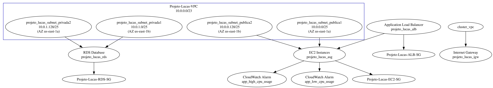

# Documentação do Projeto Terraform de Lucas - Infraestrutura AWS

## Introdução

Este documento detalha a configuração da infraestrutura AWS para um projeto de aplicação web, utilizando Terraform para automação e gerenciamento dos recursos. O projeto visa estabelecer uma arquitetura escalável, segura e de alta disponibilidade.

## Arquitetura da Infraestrutura

A arquitetura AWS proposta inclui os seguintes componentes:

- **Virtual Private Cloud (VPC)** com subnets públicas e privadas para isolamento e controle de tráfego.
- **Instâncias EC2** para hospedagem da aplicação, com configuração de Auto Scaling para escalabilidade.
- **Application Load Balancer (ALB)** para distribuição de carga e aumento da disponibilidade.
- **Banco de dados RDS MySQL** para armazenamento e gerenciamento de dados.
- **Grupos de Segurança** para definir regras de tráfego para os recursos.
- **S3 Bucket** para armazenar o estado do Terraform.

Um **diagrama visual** (não incluso aqui) é recomendado para ilustrar a interconexão desses componentes.

## Estrutura dos Arquivos Terraform

### `cloud_provider.tf`

Configura o provedor AWS e define o backend para o estado do Terraform, especificamente:

- **Provedor AWS:** Define a região (`us-east-1`) e o perfil de acesso.
- **Backend S3:** Configura o bucket S3 (`lucasgurgelbucket`) para armazenar o estado do Terraform.

### `cloudwatch_alarms.tf`

Este arquivo contém a configuração dos alarmes do CloudWatch e as políticas de escalabilidade, incluindo:

- **Alarmes de CPU:** Para monitorar a utilização de CPU das instâncias EC2 e acionar as políticas de escalabilidade.
- **Políticas de Auto Scaling:** Para aumentar ou diminuir automaticamente o número de instâncias EC2 com base na carga.

### `db_config.tf`

Configura o banco de dados RDS MySQL, abordando:

- **Criação do Banco de Dados:** Especificações do banco, como tipo de instância, tamanho de armazenamento e credenciais.
- **Backup e Manutenção:** Configurações para backup automático e janela de manutenção.

### `ec2_load_balancer.tf`

Define as configurações para EC2, Auto Scaling e ALB:

- **Launch Template para EC2:** Especificações para a criação de instâncias EC2.
- **Grupo de Auto Scaling:** Regras para escalar as instâncias EC2 automaticamente.
- **Configuração do ALB:** Detalhes do balanceador de carga, incluindo listeners e target groups.

### `networking.tf`

Estabelece a VPC e os componentes relacionados à rede:

- **VPC e Subnets:** Definição da VPC e das subnets públicas e privadas.
- **Internet Gateway:** Para conectar a VPC à internet.
- **Grupos de Segurança:** Regras para controlar o acesso às instâncias EC2 e ao RDS.

## Execução e Manutenção

### Pré-requisitos

- Instalação do Terraform e configuração da AWS CLI.
- Criação manual do bucket S3 para o estado do Terraform.

### Implantação

1. **Clonar o Repositório:** Obtenha os scripts do Terraform do repositório Git.
2. **Inicialização:** No diretório do projeto, execute `terraform init`.
3. **Planejamento:** Revise as mudanças com `terraform plan`.
4. **Aplicação:** Implante a infraestrutura com `terraform apply`.
5. **Verificação:** Confirme a criação dos recursos no console AWS.

### Manutenção

- Regularmente atualize e aplique mudanças conforme necessário.
- Monitorize os custos e a utilização dos recursos AWS.
- Utilize `terraform destroy` para descomissionar a infraestrutura, se necessário.

## Diagrama da Arquitetura AWS

## Conclusão

Esta documentação visa fornecer uma compreensão clara da infraestrutura AWS configurada para o projeto, facilitando a implantação, a manutenção e o escalonamento eficazes dos recursos. É essencial seguir as melhores práticas de segurança e estar atento aos custos associados aos serviços AWS.
